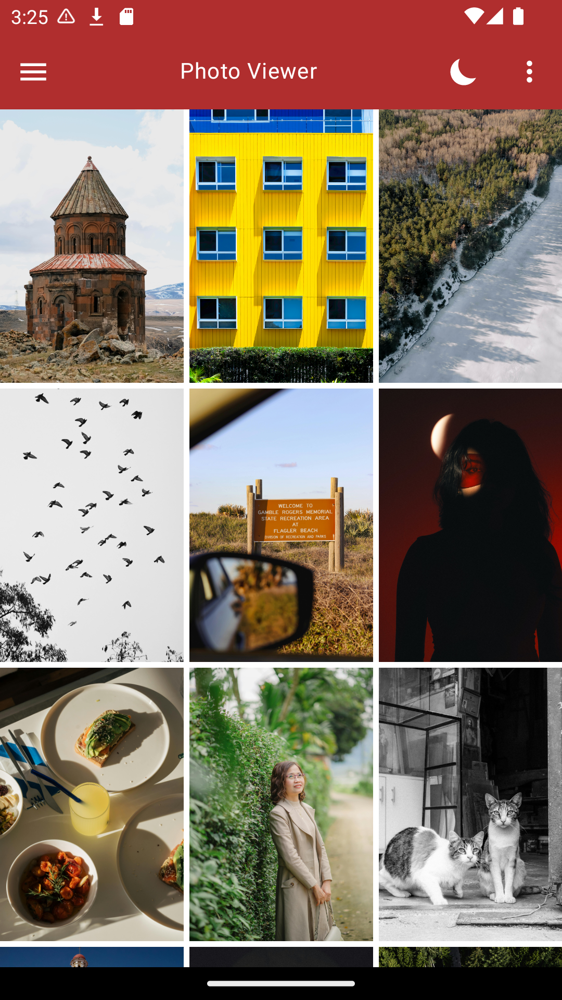

# Photo Viewer

A simple Android application that shows photos from Pexels. 

## Gallery Screen
Displays a paginated list of photos from Pexels. Supported presentation:
- Card View
- Grid View

## Details Screen
Displays a photo in a full-screen view. Can be accessed by tapping a photo.

Features:
- Share: Allows you to share the photo
- Download: Allows you to download the photo to your device

## Themes
Supports a dark and light version of the app.

# Frameworks / Technologies Used
<strong>Data:</strong> MVVM / AndroidX Paging Library  
<strong>DI:</strong> Hilt  
<strong>Network:</strong> Retrofit  
<strong>UI:</strong> Jetpack Compose  
<strong>Preferences:</strong> AndroidX Datastore  
<strong>Image Rendering:</strong> Coil  
